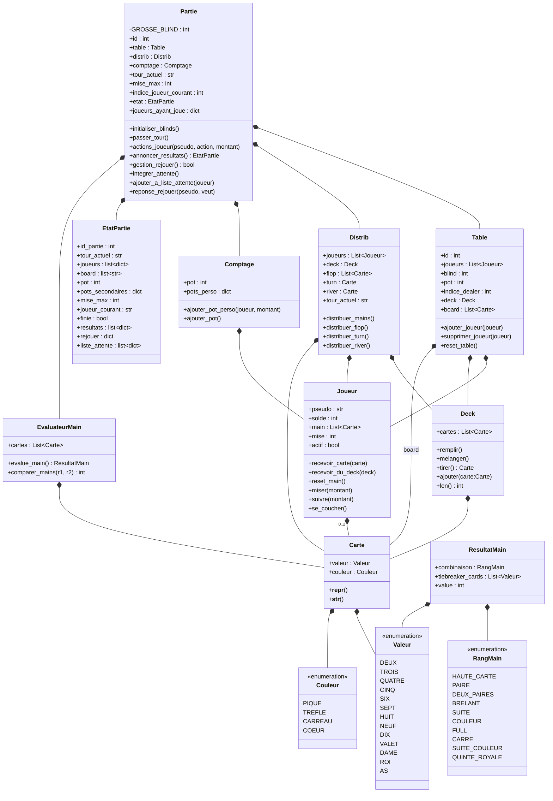

# Diagramme de classes des objets métiers

Pour afficher ce diagramme dans VScode :

* à gauche aller dans **Extensions** (ou CTRL + SHIFT + X)
* rechercher `mermaid`
  * installer l'extension **Markdown Preview Mermaid Support**
* revenir sur ce fichier
  * faire **CTRL + K**, puis **V**

